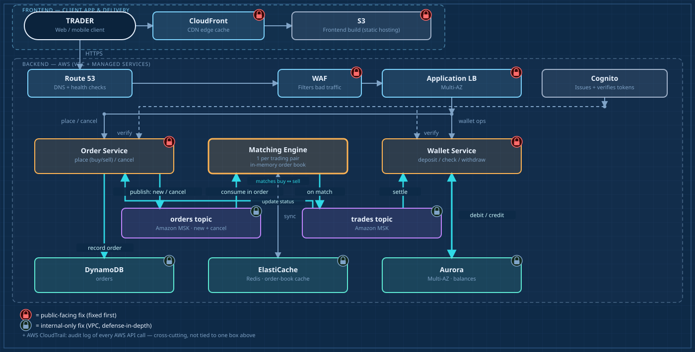

# Problem 5: Fortify The Castle

This builds on the [Problem 1](../problem1/SOLUTION.md) architecture. Same system, same diagram — this document goes through it again and adds security where it was missing, prioritized by what an attacker can actually reach from the internet.

Same diagram as Problem 1, with a lock badge on every box that got a security change — red for public-facing (fixed first), gray for internal-only/VPC (defense-in-depth). No boxes were added, removed, or moved — only what those services *do* changed.

## What's actually reachable from the internet — that comes first

Not every box in this diagram can be attacked directly. Only a few can be hit without already being inside the network:

- **CloudFront + S3** — serves the app
- **WAF + the ALB** — the API's public front door
- **Cognito** — login and token issuance
- **Order Service and Wallet Service** — whatever they expose behind the ALB is the real target, since it's the first place attacker-controlled input lands

Everything else — the Matching Engine, MSK/Kafka, Aurora, DynamoDB, Redis — sits inside the private VPC with no direct route in from the internet. Those still get fixed (below), but as defense-in-depth for *if* the public layer fails, not as the first priority. The public layer gets fixed first because it's the only part a stranger on the internet can touch without already being inside.

## OWASP Top 10 coverage

| OWASP risk | Addressed by | Reachable from the internet? |
|---|---|---|
| A01 Broken Access Control | Order/Wallet Service check that the order or wallet belongs to the caller, not just that they're logged in | Yes |
| A02 Cryptographic Failures | CloudFront and the ALB are HTTPS-only (HTTP redirected, no plaintext listener); Aurora/DynamoDB/MSK/Redis encrypted in transit and at rest | Edge/API: yes · data stores: internal |
| A03 Injection | WAF's SQLi + Core Rule Set at the edge; parameterized queries and input validation inside Order/Wallet Service as the second layer | Yes |
| A04 Insecure Design | WAF rate-based rule per IP on the public API | Yes |
| A05 Security Misconfiguration | S3 can no longer be reached directly (CloudFront-only via Origin Access Control); WAF now covers CloudFront, not just the API; Redis requires a password and is restricted to the Matching Engine | Frontend/edge: yes · Redis: internal |
| A06 Vulnerable and Outdated Components | Container images scanned in CI before deploy (see [Problem 4](../problem4/SOLUTION.md)) | Indirect — this is what ends up running behind the ALB |
| A07 Identification and Authentication Failures | Withdrawals require a recent MFA check, not just a valid session token | Yes |
| A08 Software and Data Integrity Failures | Kafka topic permissions mean only the Matching Engine can write a trade — nothing else can forge one and have Wallet Service act on it | Internal, but protects a public-triggered action (placing an order) |
| A09 Security Logging and Monitoring Failures | CloudTrail logs every AWS API call; every balance change in Aurora writes a permanent before/after record | Both |
| A10 Server-Side Request Forgery | Not applicable — no service in this design fetches a URL supplied by the user | N/A |

## Walking through the architecture with fixes marked

Same four flows Problem 1 described. 🔒 marks what's new; each is tagged with what's reachable from the internet (**public**) versus what only matters if an attacker is already inside the VPC (**internal**).

**Loading the app** (Route 53 → CloudFront → S3) — **public**
- 🔒 **The S3 bucket can no longer be reached directly.** Only CloudFront is allowed to read from it. Before this change, anyone who found the bucket's raw URL could load the app straight from S3, skipping CloudFront and WAF entirely — a very common real-world mistake. *(A05)*
- 🔒 **WAF now also sits in front of CloudFront, not just the API.** Before, WAF only filtered traffic hitting the backend API; the part of the app serving static files had no filtering at all. *(A05)*
- 🔒 **CloudFront and the ALB are HTTPS-only.** Plain HTTP is redirected, not served. *(A02)*

**Placing and matching an order** (Order Service → `orders` topic → Matching Engine → `trades` topic → Wallet Service → Aurora)
- 🔒 **Order Service checks that the order belongs to the person making the request**, not just that they're logged in. *(A01, public)* — this is the single biggest public-facing gap Problem 1 had: Cognito proved *who* was calling but nothing confirmed they were allowed to touch *this* account.
- 🔒 **Order Service validates and sanitizes its inputs, on top of WAF's filtering.** WAF is a first layer — the service itself doesn't trust that WAF caught everything. *(A03, public)*
- 🔒 **The Kafka cluster (MSK) encrypts everything and limits who can read/write each topic.** Order Service can only *write* to `orders`. Matching Engine can only *read* `orders` and *write* `trades`. Wallet Service can only *read* `trades` — it can never write to it. *(A08, internal)* — this closes the second-biggest gap: without it, any compromised service inside the VPC could forge a "trade happened" event and get Wallet Service to pay out on it.
- 🔒 **Aurora and DynamoDB encrypt their data with keys we control, require encrypted connections, and give each service only the database access it needs** — e.g. Wallet Service can update balances but can't touch the orders table or change the database's structure. *(A02 / A01, internal)*
- 🔒 **Every balance change in Aurora writes a permanent record** — what changed, by how much, before and after — in the same transaction as the change itself. *(A09, internal)*
- 🔒 **Redis requires a password and only accepts connections from the Matching Engine.** *(A05, internal)*

**Cancelling an order** — goes through the same path as placing one, so it's covered by the same fixes above. No extra work needed here.

**Depositing, checking a balance, or withdrawing** (straight to Wallet Service → Aurora) — **public**
- 🔒 **Withdrawing money requires a recent login/MFA check**, not just a valid session. If someone stole a session token, they could previously use it to withdraw funds the same as the real owner. *(A07)*
- Deposits and balance checks were left as-is on purpose — a deposit only adds money, and a check only reads it, so there's nothing risky to gate there.

**Nothing else changed.** Route 53, how containers are deployed internally, and the fact that services talk through Kafka instead of calling each other directly — all of that was already solid in Problem 1 and isn't part of the public attack surface.

**One more thing, not shown on the diagram:** turn on **CloudTrail**. It's AWS's own log of every action taken on the account. It doesn't protect any one box — it protects the ability to investigate later if something goes wrong, public-facing or not. Free to turn on, and not something you can add retroactively after an incident. *(A09)*

## What I chose not to do yet, and why

- **Per-user rate limiting inside Order Service, GuardDuty, Security Hub, tighter per-service IAM beyond database access, request de-duplication.** All reasonable — the rate limiting in particular is public-facing and OWASP-relevant (API abuse / A04) — but WAF's IP-based rate limit already covers the obvious version of this, and none of these close a hole that's currently losing money. Left out so this stays focused, not turned into an exhaustive checklist.
- **Heavier anti-abuse tooling** (AWS Shield Advanced, machine-learning fraud detection, a separate encryption key per data type, paid bot-blocking rules). Each needs real traffic or attack data to tune properly.
- **Formal security testing and legal/compliance requirements** (penetration testing). Assumed to be handled by separate processes or teams.

## Things I don't know, and what I assumed instead

- **What laws/regulations apply.** This changes what compliance checks and log-retention periods are required.
- **Whether this platform has been attacked before.** Whether to invest in Shield Advanced or fraud detection now depends on this. I assumed the platform hasn't launched yet and has no incident history — that's why those items are deferred rather than skipped entirely.
- **Whether the platform actually holds customers' money, or just facilitates trades between other custodians.** Problem 1's design (balances stored directly in Aurora) suggests the platform does hold the money itself, which is why I treated withdrawals as the highest-risk public-facing action in the system.
